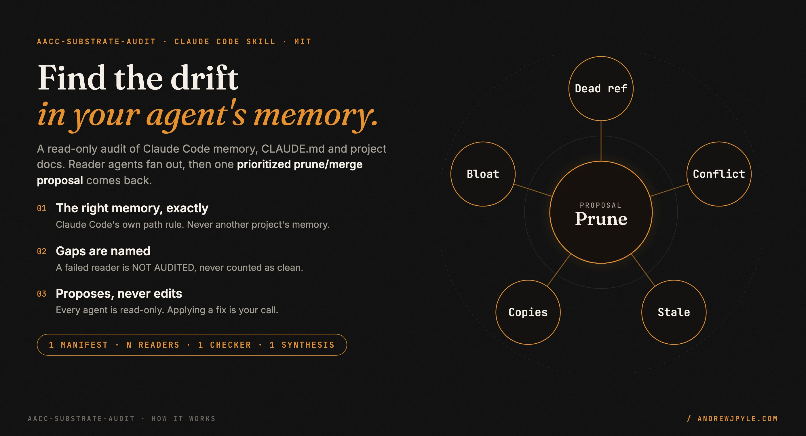
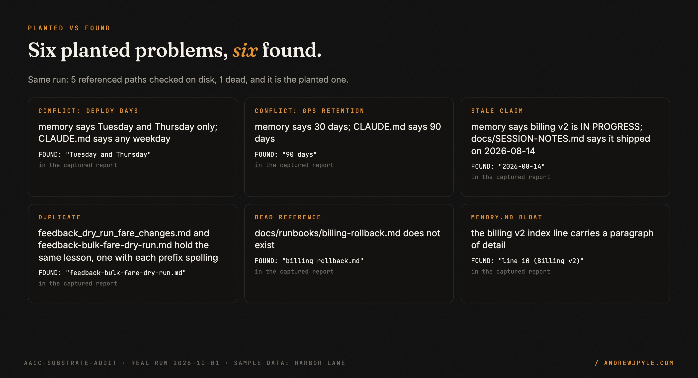
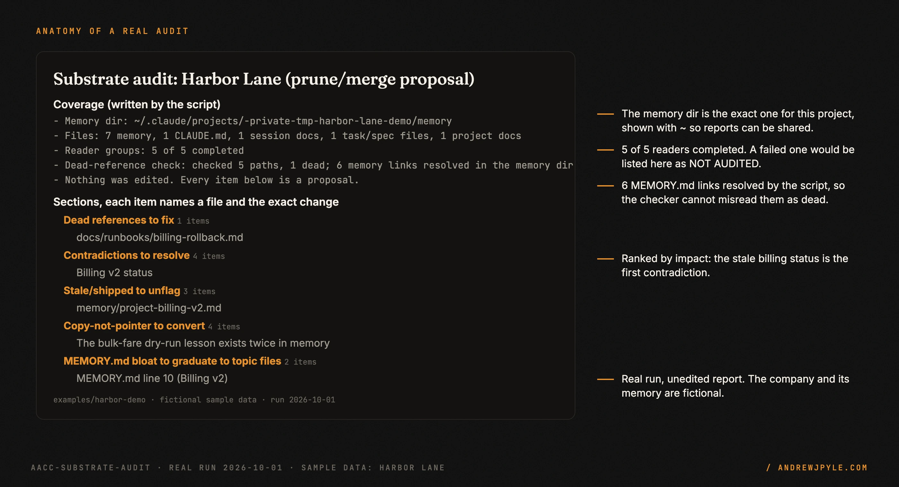
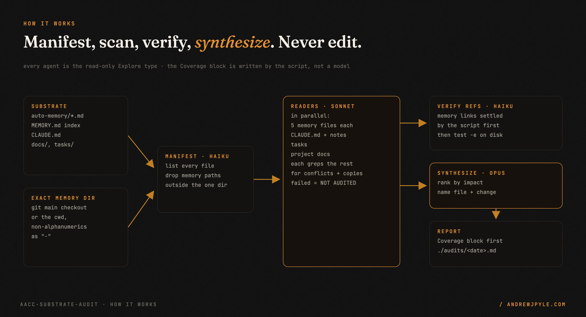

<p align="center">
  
</p>

<p align="center">
  <a href="https://github.com/andrewjpyle/aacc-substrate-audit/actions/workflows/ci.yml"></a>
  
  
</p>

# Find the contradictions, stale claims and copies in your Claude Code memory

`aacc-substrate-audit` is a Claude Code skill that audits what your agent believes about your
project: its auto-memory and `MEMORY.md`, `CLAUDE.md`, session notes, task files and docs. Reader
agents fan out over every file, a checker tests every referenced path on disk, and an Opus agent
returns **one prioritized prune/merge proposal** in which every item names a file and the exact change.

- **It reads the right memory.** It computes your project's memory directory with Claude Code's own
  path rule, so it never reads, or reports on, another project's memory.
- **It says what it did not check.** A reader that fails is listed as NOT AUDITED. A run with no memory
  says so. Nothing missing is ever counted as clean.
- **Read-only.** Every agent runs as Claude Code's read-only `Explore` type. It writes one report file
  and never edits your memory.

> **The one idea worth stealing, even if you never run this code:** an agent's memory needs the same
> hygiene as a codebase, because it is code the agent executes. A memory that still says "billing v2
> is IN PROGRESS, keep the dual-write flag on" six weeks after the cutover shipped is a bug: the next
> session will act on a system that no longer exists. Audit for contradictions and stale claims on a
> schedule, and give every fact one home that other files point to.

---

## What you get

A real run against [a fictional demo project](examples/harbor-demo): a bike-share company with a
deliberately messy sample memory. Six problems were planted; the audit found all six, and its
dead-reference check flagged only the one real broken path.

<p align="center"></p>

The report opens with a Coverage block written by the script, not the model, then ranks every fix.
An excerpt from the unedited report
([full report](examples/harbor-demo/audits/substrate_audit_2026-10-01.md)):

> 2. **GPS trace retention.** A person must decide; this may be a compliance issue.
>    - `CLAUDE.md` line 8: "kept for 90 days for theft investigations, then purged."
>    - `memory/project-gps-retention.md` and `MEMORY.md` line 7: 30 days, described as a public privacy-policy commitment.

<p align="center"></p>

## Install

Copy this folder into your Claude Code skills directory:

```bash
git clone https://github.com/andrewjpyle/aacc-substrate-audit.git ~/.claude/skills/aacc-substrate-audit
```

`~/.claude/skills/aacc-substrate-audit/SKILL.md` and `substrate_audit_workflow.js` must both exist. A
project-local `.claude/skills/aacc-substrate-audit/` works too. Open a new Claude Code session so it
picks up the skill.

**Requires** Claude Code with the `Workflow` tool, which runs the fan-out and the model tiering.

## Run it

From the root of the project you want audited:

```
/aacc-substrate-audit
```

Or just ask: "is anything stale or contradictory in my memory?", "audit my CLAUDE.md and memory".
The report is written to `./audits/substrate_audit_<YYYY-MM-DD>.md` and the top actions are shown
inline. Then you choose which fixes to apply, one at a time.

| Option (Workflow `args`) | Default | What it does |
|---|---|---|
| `focus: "memory"` | `"all"` | audit only the auto-memory; refuses if none is found |
| `memory_dir: "/abs/path"` | computed | use this memory dir as given, for `autoMemoryDirectory` or `CLAUDE_CODE_PROJECT_DIR_NAME` setups |

## How it works

<p align="center"></p>

1. **Manifest (Haiku).** Lists every substrate file. The memory directory is
   `<config dir>/projects/<project>/memory`, where `<config dir>` is `$CLAUDE_CONFIG_DIR` or
   `~/.claude`, and `<project>` is the git repository's main checkout (or the cwd outside git) with
   every non-alphanumeric character replaced by `-`. That matches
   [Claude Code's documented rule](https://code.claude.com/docs/en/memory#storage-location), so
   worktrees and subdirectories share one memory. Any memory path outside that one directory is dropped.
2. **Scan (Sonnet, in parallel).** One reader per five memory files, plus one each for `CLAUDE.md` with
   session notes, tasks, and project docs. Each reads its files in full and greps the rest of the
   substrate, so a contradiction between two files in different groups is still visible.
3. **Verify refs (Haiku).** The script first settles what it already knows: a bare file name that
   matches a memory file is a `MEMORY.md` link, and a token like a feature-flag name is not a path.
   Only the remaining paths are tested on disk.
4. **Synthesize (Opus).** Merges the findings into five ranked sections: dead references,
   contradictions, stale or shipped-but-marked-open claims, copies that should be pointers, and
   `MEMORY.md` lines that should move to a topic file. Claude Code loads only the first 200 lines (or
   25KB) of `MEMORY.md` at session start, so a bloated index stops loading in full.

## Failure handling

| What goes wrong | What the skill does |
|---|---|
| The manifest agent fails | raises an error, instead of an empty audit that reads as clean |
| No memory at the project's path | audits the other files and says memory was NOT audited |
| Nothing at all to audit | refuses, instead of reporting an empty substrate as clean |
| A reader agent fails | lists its files as NOT AUDITED and marks the summary INCOMPLETE AUDIT |
| Every reader fails | refuses to produce an audit |
| The dead-reference check fails | says "not checked", never "none found" |
| The synthesizer returns nothing | raises an error instead of an empty result |

Each row has a test in `test/workflow.test.mjs`, which runs the real workflow script with stubbed agents.

## Scope: what it does not do

- **It does not fix anything.** It proposes. Applying a change is a separate step you approve.
- **It does not decide which side of a contradiction is right.** When two files disagree and neither is
  clearly newer, the report says a person has to decide, as it did for the demo's deploy window.
- **It does not read your code.** It checks that referenced paths exist, not that the code does what a
  memory claims.
- **It cannot see an `autoMemoryDirectory` setting on its own.** Pass `memory_dir` for that.
- **Results are model output.** Wording varies between runs, and a reader can miss something. The
  Coverage block tells you what was read; it cannot promise a reader caught everything in it.

## The patterns

| Pattern | The failure it prevents |
|---|---|
| Exact memory path, never a fuzzy match | an audit of the wrong project's memory |
| Drop memory paths outside the one directory | a second project's notes mixed into the report |
| Failed agent = NOT AUDITED, in a script-written Coverage block | a partial run that reads as a clean bill of health |
| Refuse an empty substrate | a confident "all clean" about nothing |
| Settle known links in code before the model checks paths | `MEMORY.md` links reported as dead (7 of 8 flags in the [first demo run](examples/harbor-demo/audits/before_fix/substrate_audit_2026-10-01.md) were this or a flag name) |
| Read-only agent type, not just a "do not edit" prompt | an auditor that "tidies up" your memory without asking |
| One home per fact, pointers elsewhere | the same rule drifting apart in three files |

## FAQ

**Does it change my memory or my docs?** No. Every agent is the read-only `Explore` type. The skill
writes one report under `./audits/`.

**What does a run cost?** One Haiku manifest, one Sonnet reader per five memory files plus up to three
more for the other stores, one Haiku checker, one Opus synthesizer. The demo run used 8 agents.

**Why would my memory contradict itself?** Facts get written in a hurry, in more than one place, and
only one copy gets updated when things change. The demo's billing entry is the typical case.

**Why "aacc"?** It was extracted from the author's agent operations platform (AACC). The skill has no
dependency on it.

## Development

```bash
npm test     # 24 tests: the real workflow script with stubbed agents, plus the real memory-dir shell command
```

Graphics are built from code and from the committed capture of the demo run:
`python3 docs/assets/src/build.py`, then render with `docs/assets/src/render.py`.

## Roadmap

- Resolve `autoMemoryDirectory` from settings automatically instead of requiring `memory_dir`.
- An optional pass that checks memory claims against the code they describe.

## License

MIT. By [Andrew Pyle](https://andrewjpyle.com).
